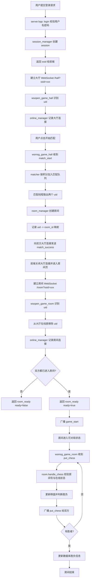
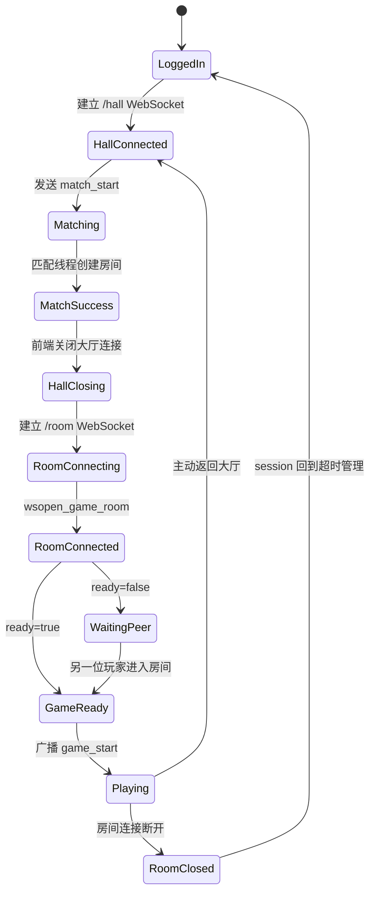
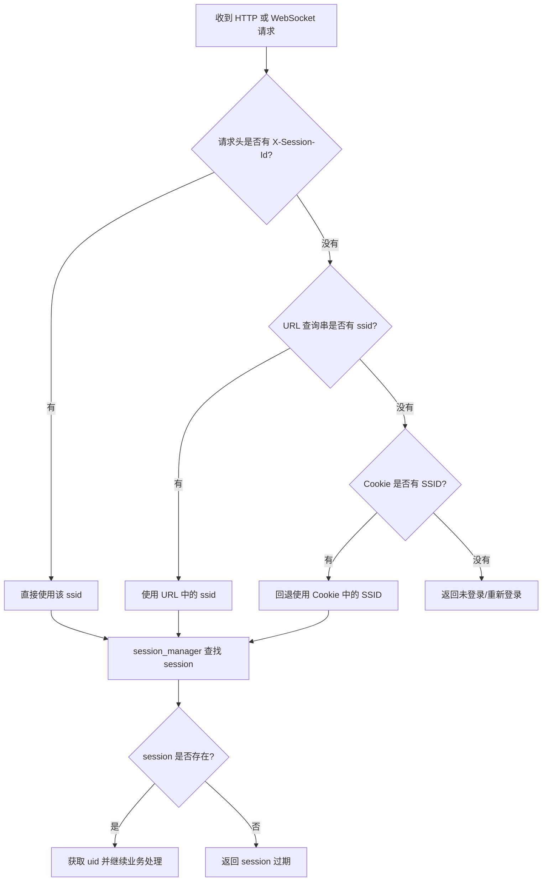
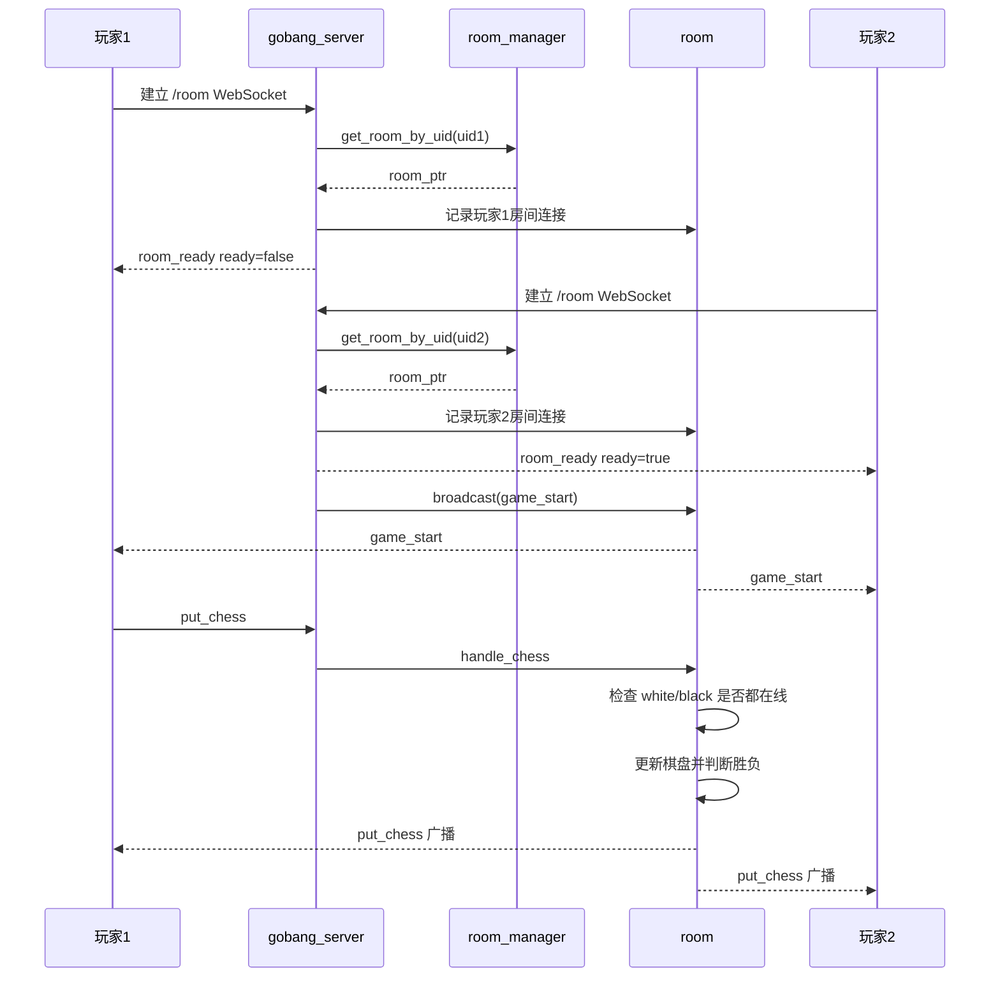
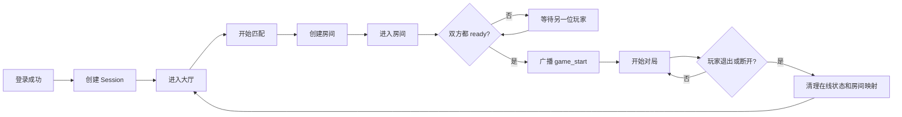

# 五子棋项目后端问题分析与修复说明

## 1. 文档目的

这份文档只说明这次排查和修复过程中涉及的后端问题，不讨论前端样式、棋盘图片等纯前端问题。

目标是回答三个问题：

1. 原来的后端代码到底哪里有问题。
2. 这些问题为什么会表现成“重复登录”“房间号不匹配”“自动掉线”等现象。
3. 这次分别是怎么修复的。

---

## 2. 最初的现象

最开始你遇到的现象并不是单一 bug，而是多个状态问题叠加后的结果，主要包括：

1. 两个玩家匹配成功后进入同一个房间，其中一方会报“房间号不匹配”。
2. 玩家进入房间后，有时会出现“重复登录”的提示。
3. 有时房间刚建立，一方还没正式开始下棋，就被系统判成掉线。
4. 匹配按钮偶尔点了没反应。

这些问题表面上看像是不同问题，但本质都和后端的“会话识别”“在线状态切换”“房间生命周期管理”有关。

---

## 3. 根因总览

这次后端的主要问题可以分成四类：

1. 会话识别方式不稳定。
2. WebSocket 路由匹配方式错误。
3. 大厅和房间之间的在线状态切换不正确。
4. 房间在双方都未真正 ready 之前就允许开始对局。

下面分开说明。

---

## 4. 问题一：会话识别不稳定

### 4.1 原来的实现

原来的后端逻辑主要依赖 Cookie 里的 `SSID` 来识别当前用户。

也就是说：

1. 登录成功后，服务端创建 session。
2. 服务端通过 `Set-Cookie` 把 `SSID` 回给浏览器。
3. 后续 HTTP 和 WebSocket 请求，再从 Cookie 中取出这个 `SSID`。

这套方案在“一个浏览器、一个账号、一个页面”的时候通常没问题。

### 4.2 为什么会出问题

一旦你用同一个浏览器开多个标签页，分别登录不同账号，Cookie 是共享的。

结果就是：

1. 第一个标签页登录后，浏览器里有一个 `SSID=A`。
2. 第二个标签页再登录另一个账号，浏览器里的 Cookie 会被覆盖成 `SSID=B`。
3. 这时第一个标签页虽然页面上看起来还是第一个账号，但它后续再发 HTTP 或 WebSocket 请求时，服务端读到的可能已经是第二个账号的 `SSID`。

这会直接导致：

1. 房间里的两个连接可能被识别成同一个用户。
2. 大厅连接关闭时，服务端可能把另一个玩家的 session 也处理掉。
3. 房间号、用户 ID、在线状态全部可能串掉。

### 4.3 相关文件

主要涉及：

1. `source/server.hpp`
2. `source/session.hpp`

### 4.4 修复方式

修复思路是：不能只依赖共享 Cookie，必须允许前端显式传递当前标签页自己的 session 标识。

因此在 `source/server.hpp` 中增加了这几个能力：

1. 新增 `get_query_val()` 用于从 URL 查询串中提取参数。
2. 新增 `get_uri_path()` 用于剥离 URI 的查询参数。
3. 新增 `get_ssid_str()`，按下面优先级统一获取 SSID：
   - 先读 `X-Session-Id` 请求头。
   - 再读 WebSocket URL 查询参数中的 `ssid`。
   - 最后才回退到 Cookie 中的 `SSID`。

并且登录接口不再只返回一个“登录成功”，而是会把新建 session 的 `ssid` 直接放进响应 JSON 中，让前端能够显式携带。

这样一来，每个标签页都可以带自己的 SSID，后端不再完全依赖共享 Cookie，自然就不会因为浏览器多标签页而串号。

---

## 5. 问题二：WebSocket 路由匹配方式错误

### 5.1 原来的实现

原来 `source/server.hpp` 中，WebSocket 路由判断基本都是直接比较：

1. `req.get_uri() == "/hall"`
2. `req.get_uri() == "/room"`

### 5.2 为什么会出问题

在前面为了修 session 串号之后，前端 WebSocket 地址变成了：

1. `/hall?ssid=xxx`
2. `/room?ssid=xxx`

这时如果服务端仍然拿完整 URI 直接比较，那么：

1. `/hall?ssid=xxx` 不等于 `/hall`
2. `/room?ssid=xxx` 不等于 `/room`

结果就是：

1. `wsopen_callback()` 匹配不到大厅或房间。
2. `wsclose_callback()` 匹配不到关闭处理逻辑。
3. `wsmsg_callback()` 匹配不到消息处理逻辑。

于是你会看到：

1. 匹配按钮点了没反应。
2. 房间请求没有被正确处理。
3. 看起来像服务端没收到消息。

### 5.3 修复方式

修复方式很直接：所有使用 `req.get_uri()` 做路径判断的地方，都先经过 `get_uri_path()` 把查询串去掉，再按路径判断。

也就是说：

1. `http_callback()` 先取纯路径。
2. `file_handler()` 先取纯路径。
3. `wsopen_callback()` 先取纯路径。
4. `wsclose_callback()` 先取纯路径。
5. `wsmsg_callback()` 先取纯路径。

这样不管 URI 后面有没有 `?ssid=...`，最终都能正确落到 `/hall` 或 `/room` 的逻辑分支。

---

## 6. 问题三：在线状态管理不正确

### 6.1 原来的实现

在线用户管理在 `source/online.hpp` 中，原来大厅和房间在线表的写入方式是：

1. `_hall_user.insert({uid, conn});`
2. `_room_user.insert({uid, conn});`

### 6.2 为什么会出问题

`insert()` 的特点是：

1. 如果 key 不存在，插入成功。
2. 如果 key 已存在，不会覆盖旧值。

而你的场景里，WebSocket 连接存在“旧连接还没完全清理，新连接已经建立”的情况。

这时会发生：

1. 在线表里已经有一个旧连接。
2. 新连接建立时，`insert()` 因 key 已存在而失败。
3. 在线表仍然保留旧连接。
4. 后面服务端再根据 uid 去拿连接发消息时，取到的是旧连接甚至空状态。

这就会造成：

1. 明明玩家已经进房，服务端却说“获取房间连接失败”。
2. 一方发消息，另一方收不到。
3. 状态看起来像有人掉线或者重复登录。

### 6.3 修复方式

在 `source/online.hpp` 中，把 `insert()` 改成覆盖赋值：

1. `_hall_user[uid] = conn;`
2. `_room_user[uid] = conn;`

这样即使旧连接还在，新连接也会直接把旧连接覆盖掉，在线表始终保存最新的有效连接。

这属于非常关键的修复。

---

## 7. 问题四：大厅和房间之间的状态切换有竞态

### 7.1 原来的实现

原来的逻辑默认认为：

1. 玩家离开大厅后，close 会及时触发。
2. 玩家进入房间时，大厅连接已经彻底清理。
3. 只要用户已经出现在大厅或房间在线表里，就可以直接判为“重复登录”。

### 7.2 为什么会出问题

真实运行时，WebSocket 的 open 和 close 并不一定按你期望的顺序严格到达。

常见场景是：

1. 玩家在大厅中匹配成功。
2. 前端开始跳转房间页。
3. 房间 WebSocket 已经建立，但大厅的 close 回调还没执行。

如果这时服务端还按“只要在大厅里就不能进房间”的思路处理，就会把正常切换误判成重复登录。

另外，大厅 close 如果晚到，而服务端又不检查玩家是否已经在房间，就可能把本该永久有效的 session 重新改回超时状态。

这就会引出：

1. 进入房间时报重复登录。
2. 进房后 session 被莫名回收。
3. 后续房间请求拿不到正确身份。

### 7.3 修复方式

这部分主要在 `source/server.hpp` 中修。

#### 7.3.1 `wsopen_game_hall()`

现在的逻辑是：

1. 先识别当前 uid。
2. 如果这个 uid 还在房间在线表中，视为“用户主动回大厅”。
3. 先从房间在线表里移除，再从房间管理器中移除用户。
4. 最后再加入大厅在线表。

这相当于让“回大厅”成为一个可恢复、可自洽的动作，而不是直接报错。

#### 7.3.2 `wsopen_game_room()`

现在的逻辑是：

1. 如果用户还在大厅在线表里，先将其移出大厅。
2. 再去房间管理器里查找该用户对应的房间。
3. 找到后，把当前连接加入房间在线表。

这让“大厅 -> 房间”的切换变成了平滑迁移，而不是非此即彼的死板判断。

#### 7.3.3 `wsclose_game_hall()`

现在关闭大厅连接时，服务端会先判断用户是否已经在房间里：

1. 如果用户已经在房间里，就不再把 session 改回超时状态。
2. 只有用户确实不在房间里时，才恢复 session 超时回收。

这一步解决了“房间刚建立，大厅连接晚到的 close 把 session 弄没了”的问题。

---

## 8. 问题五：房间用户映射没有及时清理

### 8.1 原来的实现

在 `source/room.hpp` 的房间管理器里，`_users` 用来维护：

1. 用户 ID -> 房间 ID

原来的 `remove_room_user()` 只做了：

1. 调用房间对象的退出处理。
2. 如果房间没人了再销毁房间。

但它没有第一时间把该用户的 `_users[uid]` 映射删掉。

### 8.2 为什么会出问题

如果一个玩家已经离开房间，但 `_users` 里还保留着旧房间映射，那么后续：

1. 重连房间时，可能还会查到旧房间。
2. 回大厅后再进房，可能命中已经无效的房间对象。
3. 新的房间状态和旧房间状态混在一起。

最终就会表现成：

1. 房间号不匹配。
2. 找不到玩家房间信息。
3. 明明已经退出了，还像留在旧房间里。

### 8.3 修复方式

在 `source/room.hpp` 的 `remove_room_user()` 中，先加了一步：

1. 先从 `_users` 中删除 `uid -> room_id` 映射。
2. 再处理房间退出。
3. 最后如果房间没人了，再销毁整个房间。

这保证了用户一旦离开房间，用户到房间的映射立即失效。

---

## 9. 问题六：房间还没真正 ready 就允许走棋

### 9.1 原来的实现

原来的房间逻辑在 `source/room.hpp` 中，`handle_chess()` 只要收到落子请求，就会立即检查双方是否在线。

但原来的处理方式是：

1. 如果白棋不在线，直接判黑棋获胜。
2. 如果黑棋不在线，直接判白棋获胜。

### 9.2 为什么会出问题

在真实流程里，可能出现这种情况：

1. 第一个玩家已经进入房间。
2. 第二个玩家的 room WebSocket 还没完全建立。
3. 第一个玩家已经点了棋盘发出落子请求。

这时服务端看到另一方还不在房间在线表里，就会直接当成掉线处理。

于是你看到的现象就是：

1. 明明对方只是还没连上来。
2. 系统却直接判成“不战而胜”。

### 9.3 修复方式

修复分成两层。

#### 9.3.1 在房间对象中增加 ready 判断

在 `source/room.hpp` 中增加了 `is_all_player_online()`：

1. 只有白棋和黑棋都在房间在线表里，才返回 true。

#### 9.3.2 未 ready 前不再直接判胜

在 `handle_chess()` 中：

1. 如果白棋未进房，返回失败，不判胜。
2. 如果黑棋未进房，返回失败，不判胜。

这样“另一方尚未进房”和“另一方中途掉线”就被区分开了。

---

## 10. 问题七：房间 ready 广播机制缺失

### 10.1 原来的实现

原来 `wsopen_game_room()` 在一个玩家进入房间后，只会告诉这个玩家 `room_ready`，但不会明确告诉双方：“现在两边都进房了，可以正式开始了”。

### 10.2 为什么会出问题

没有这个“正式开局”的同步点，双方页面就会自行猜当前是否已经可以落子，这很容易导致：

1. 一个人已经以为能走了。
2. 另一个人还没完全准备好。

从而继续放大前面的状态竞态问题。

### 10.3 修复方式

在 `source/server.hpp` 的 `wsopen_game_room()` 中：

1. 当单个玩家进入房间时，返回 `room_ready`。
2. 同时附带 `ready` 字段，告诉前端双方是否都已在线。
3. 如果 `is_all_player_online()` 返回 true，则立即广播 `game_start` 给整个房间。

这一步把“进入房间”和“正式开局”拆开了。

从后端角度看，这种设计比以前更稳，因为它明确增加了一个双人同步点。

---

## 11. 问题八：先手执子规则与业务预期不一致

### 11.1 原来的实现

在 `source/room.hpp` 的 `create_room()` 中，原始逻辑是：

1. `uid1` 被设置为白棋。
2. `uid2` 被设置为黑棋。

这意味着：

1. 第一个匹配成功的玩家默认是白棋。
2. 第二个玩家默认是黑棋。

### 11.2 为什么会出问题

按照五子棋常规规则，应该是黑棋先手。

而你的整体流程里，第一个匹配到房间的玩家通常会被当成先进入对局的一方，所以如果仍把它设成白棋，就会导致：

1. 业务规则和玩家感知不一致。
2. 前端很容易围绕错误的颜色假设继续产生二次问题。

### 11.3 修复方式

在 `source/room.hpp` 的 `create_room()` 中改成：

1. `uid1` 执黑。
2. `uid2` 执白。

这样从后端定义层面就统一了“黑棋先手”的规则。

---

## 12. 这次后端修复的实际效果

修完之后，后端层面获得了这些改进：

1. 不再单纯依赖共享 Cookie 识别用户，会话识别更稳定。
2. WebSocket 带查询参数后仍能正确匹配 `/hall` 和 `/room`。
3. 大厅和房间之间的状态切换不再容易误判成重复登录。
4. 在线表始终保留最新连接，不再被旧连接卡住。
5. 用户离开房间后，房间映射及时清除，不再残留脏状态。
6. 双方都真正进房后才正式开局，避免误判掉线。
7. 后端的黑白棋角色分配更符合规则。

---

## 13. 最终结论

如果只总结一句话，这次后端真正的问题是：

**原始实现把“用户身份识别”“WebSocket 路由”“在线状态切换”“房间生命周期”都建立在过于理想的时序假设上，而真实运行环境里的多标签页、异步连接建立与关闭，会把这些假设全部打破。**

所以这次修复并不是单纯改一行判断，而是把整个房间进入链路变成了：

1. 身份识别更稳定。
2. 路由匹配更稳。
3. 在线状态切换更可恢复。
4. 房间 ready 条件更严格。

这也是为什么修完后，最初那一串看起来彼此无关的问题，最后能一起收敛下来。

---

## 14. 后续建议

如果你后面还想继续完善后端，我建议优先做下面几件事：

1. 给 `server.hpp` 的大厅/房间 open、close、message 加统一日志格式，包含 `uid`、`ssid`、`room_id`。
2. 给 `room.hpp` 的落子请求增加越界校验和轮到谁下的严格校验。
3. 给静态文件响应补上更完整的 Content-Type 和大文件二进制传输处理。
4. 给匹配和房间状态补最基本的自动化测试或至少做更系统的日志验证。

如果你愿意，下一步我可以继续把这份文档整理成“问题 -> 根因 -> 修复前代码 -> 修复后代码”的对照版。

---

## 15. 关键代码对照版

这一部分把几个最关键的后端问题整理成“修复前 vs 修复后”的对照形式，便于你讲解时直接引用。

---

## 16. 对照一：会话识别方式

### 16.1 修复前

修复前的核心问题是：服务端主要依赖 Cookie 中的 `SSID`，没有统一的“多来源取 session”逻辑。

可以把修复前的思路概括成下面这样：

```cpp
std::string cookie_str = conn->get_request_header("Cookie");
if (cookie_str.empty()) {
   return session_ptr();
}

std::string ssid_str;
bool ret = get_cookie_val(cookie_str, "SSID", ssid_str);
if (ret == false) {
   return session_ptr();
}

session_ptr ssp = _sm.get_session_by_ssid(std::stol(ssid_str));
```

这个写法的问题是：

1. 只认 Cookie。
2. 同一浏览器多标签页登录不同账号时，Cookie 会互相覆盖。
3. WebSocket 和 HTTP 请求会读到错误的 session。

### 16.2 修复后

修复后在 [source/server.hpp](source/server.hpp#L65) 到 [source/server.hpp](source/server.hpp#L108) 增加了统一的会话提取逻辑：

```cpp
bool get_ssid_str(wsserver_t::connection_ptr conn, std::string &ssid_str) {
   ssid_str = conn->get_request_header("X-Session-Id");
   if (ssid_str.empty() == false) {
      return true;
   }

   websocketpp::http::parser::request req = conn->get_request();
   if (get_query_val(req.get_uri(), "ssid", ssid_str)) {
      return true;
   }

   std::string cookie_str = conn->get_request_header("Cookie");
   if (cookie_str.empty()) {
      return false;
   }
   return get_cookie_val(cookie_str, "SSID", ssid_str);
}
```

然后在 [source/server.hpp](source/server.hpp#L247) 到 [source/server.hpp](source/server.hpp#L269) 中统一使用：

```cpp
std::string ssid_str;
bool ret = get_ssid_str(conn, ssid_str);
if (ret == false) {
   // 返回错误
}
session_ptr ssp = _sm.get_session_by_ssid(std::stol(ssid_str));
```

### 16.3 修复收益

修复后的收益是：

1. 不再强依赖共享 Cookie。
2. 同一浏览器多标签页可以携带各自独立的 ssid。
3. 用户身份识别稳定下来，后续的房间和大厅逻辑才有意义。

---

## 17. 对照二：WebSocket 路由匹配

### 17.1 修复前

修复前的路由判断本质上是下面这种形式：

```cpp
std::string uri = req.get_uri();
if (uri == "/hall") {
   return wsopen_game_hall(conn);
} else if (uri == "/room") {
   return wsopen_game_room(conn);
}
```

一旦前端开始显式携带 `ssid`，URI 变成 `/hall?ssid=xxx` 或 `/room?ssid=xxx`，这些判断就全失效了。

### 17.2 修复后

修复后先在 [source/server.hpp](source/server.hpp#L86) 到 [source/server.hpp](source/server.hpp#L91) 定义：

```cpp
std::string get_uri_path(const std::string &uri) {
   size_t pos = uri.find('?');
   if (pos == std::string::npos) {
      return uri;
   }
   return uri.substr(0, pos);
}
```

再统一在回调里使用：

```cpp
std::string uri = get_uri_path(req.get_uri());
if (uri == "/hall") {
   return wsopen_game_hall(conn);
} else if (uri == "/room") {
   return wsopen_game_room(conn);
}
```

这个修法不仅用在 `wsopen_callback()`，也同步用到了：

1. [source/server.hpp](source/server.hpp#L227) 到 [source/server.hpp](source/server.hpp#L240) 的 `http_callback()`
2. [source/server.hpp](source/server.hpp#L339) 到 [source/server.hpp](source/server.hpp#L350) 的 `wsopen_callback()`
3. [source/server.hpp](source/server.hpp#L380) 到 [source/server.hpp](source/server.hpp#L391) 的 `wsclose_callback()`
4. [source/server.hpp](source/server.hpp#L461) 到 [source/server.hpp](source/server.hpp#L472) 的 `wsmsg_callback()`

### 17.3 修复收益

修复后的收益是：

1. 前端 URL 带参数不再影响大厅和房间路由。
2. 匹配、进房、消息收发都能重新命中正确分支。

---

## 18. 对照三：在线连接管理

### 18.1 修复前

修复前 [source/online.hpp](source/online.hpp) 的大厅和房间连接登记是：

```cpp
_hall_user.insert({uid, conn});
_room_user.insert({uid, conn});
```

这个写法一旦遇到“旧连接还没删，新连接已经到了”，新连接就写不进去。

### 18.2 修复后

修复后在 [source/online.hpp](source/online.hpp#L22) 到 [source/online.hpp](source/online.hpp#L31) 改成了：

```cpp
_hall_user[uid] = conn;
_room_user[uid] = conn;
```

### 18.3 修复收益

修复后的收益是：

1. 新连接会覆盖旧连接。
2. 在线表中始终保存当前最新连接。
3. 服务端给房间广播消息时，不容易再出现“明明在线却取不到连接”的问题。

---

## 19. 对照四：大厅到房间的切换逻辑

### 19.1 修复前

修复前的思路可以概括成：

```cpp
if (_om.is_in_game_hall(uid) || _om.is_in_game_room(uid)) {
   resp_json["optype"] = "room_ready";
   resp_json["reason"] = "玩家重复登录！";
   resp_json["result"] = false;
   return ws_resp(conn, resp_json);
}
```

这个判断看起来合理，但它默认了大厅连接一定比房间连接先关闭。现实里这并不成立。

### 19.2 修复后

修复后在 [source/server.hpp](source/server.hpp#L294) 到 [source/server.hpp](source/server.hpp#L337) 改成了平滑切换：

```cpp
uint64_t uid = ssp->get_user();
if (_om.is_in_game_hall(uid)) {
   _om.exit_game_hall(uid);
}

room_ptr rp = _rm.get_room_by_uid(uid);
if (rp.get() == nullptr) {
   resp_json["optype"] = "room_ready";
   resp_json["reason"] = "没有找到玩家的房间信息";
   resp_json["result"] = false;
   return ws_resp(conn, resp_json);
}

_om.enter_game_room(uid, conn);
_sm.set_session_expire_time(ssp->ssid(), SESSION_FOREVER);
```

同时在 [source/server.hpp](source/server.hpp#L352) 到 [source/server.hpp](source/server.hpp#L366) 中修正了大厅 close 的处理：

```cpp
uint64_t uid = ssp->get_user();
_om.exit_game_hall(uid);
if (_om.is_in_game_room(uid) == false) {
   _sm.set_session_expire_time(ssp->ssid(), SESSION_TIMEOUT);
}
```

### 19.3 修复收益

修复后的收益是：

1. 大厅到房间切换不再轻易报“重复登录”。
2. 大厅连接晚到的 close 不会误回收房间中的 session。
3. 房间建立过程更符合真实异步连接时序。

---

## 20. 对照五：房间未 ready 就开始走棋

### 20.1 修复前

修复前在 `handle_chess()` 中，只要检测到对方不在线，就直接判另一方获胜，逻辑本质上是：

```cpp
if (_online_user->is_in_game_room(_white_id) == false) {
   json_resp["result"] = true;
   json_resp["reason"] = "运气真好！对方掉线，不战而胜！";
   json_resp["winner"] = (Json::UInt64)_black_id;
   return json_resp;
}
```

这会把“对方还没连进房间”和“对方中途掉线”混为一谈。

### 20.2 修复后

修复后在 [source/room.hpp](source/room.hpp#L78) 到 [source/room.hpp](source/room.hpp#L117) 中做了两个调整。

第一步是增加房间就绪判断：

```cpp
bool is_all_player_online() {
   return _online_user->is_in_game_room(_white_id) &&
         _online_user->is_in_game_room(_black_id);
}
```

第二步是把未就绪前的处理改成“拒绝下棋，不判胜”：

```cpp
if (_online_user->is_in_game_room(_white_id) == false) {
   json_resp["result"] = false;
   json_resp["reason"] = "白棋玩家尚未进入房间，请稍候";
   json_resp["winner"] = (Json::UInt64)0;
   return json_resp;
}
if (_online_user->is_in_game_room(_black_id) == false) {
   json_resp["result"] = false;
   json_resp["reason"] = "黑棋玩家尚未进入房间，请稍候";
   json_resp["winner"] = (Json::UInt64)0;
   return json_resp;
}
```

### 20.3 修复收益

修复后的收益是：

1. 房间只有在双方真正 ready 后才能落子。
2. 不再把“还没进房”误判成“掉线”。
3. 自动判胜的错误场景被消掉了。

---

## 21. 对照六：房间 ready 广播机制

### 21.1 修复前

修复前的房间进入逻辑只会简单返回一个 `room_ready`，但没有明确告诉双方：现在两边都已就绪，可以开始对局了。

可以概括成：

```cpp
resp_json["optype"] = "room_ready";
resp_json["result"] = true;
resp_json["room_id"] = rp->id();
return ws_resp(conn, resp_json);
```

### 21.2 修复后

修复后在 [source/server.hpp](source/server.hpp#L318) 到 [source/server.hpp](source/server.hpp#L337) 中分成两步：

```cpp
resp_json["optype"] = "room_ready";
resp_json["result"] = true;
resp_json["room_id"] = (Json::UInt64)rp->id();
resp_json["uid"] = (Json::UInt64)uid;
resp_json["white_id"] = (Json::UInt64)rp->get_white_user();
resp_json["black_id"] = (Json::UInt64)rp->get_black_user();
resp_json["ready"] = rp->is_all_player_online();
ws_resp(conn, resp_json);

if (rp->is_all_player_online()) {
   Json::Value start_resp;
   start_resp["optype"] = "game_start";
   start_resp["result"] = true;
   start_resp["room_id"] = (Json::UInt64)rp->id();
   start_resp["white_id"] = (Json::UInt64)rp->get_white_user();
   start_resp["black_id"] = (Json::UInt64)rp->get_black_user();
   rp->broadcast(start_resp);
}
```

### 21.3 修复收益

修复后的收益是：

1. 进入房间和正式开局被明确分开。
2. 前端能知道“我进入房间了”和“双方都 ready 了”是两个不同状态。
3. 双方同步更清晰，竞态更少。

---

## 22. 对照七：房间用户映射清理

### 22.1 修复前

修复前 `remove_room_user()` 主要是：

```cpp
room_ptr rp = get_room_by_uid(uid);
if (rp.get() == nullptr) {
   return;
}
rp->handle_exit(uid);
if (rp->player_count() == 0) {
   remove_room(rp->id());
}
```

问题是这段代码没有先删掉 `_users` 里的用户到房间映射。

### 22.2 修复后

修复后在 [source/room.hpp](source/room.hpp#L302) 到 [source/room.hpp](source/room.hpp#L317) 中先删映射，再处理退出：

```cpp
room_ptr rp = get_room_by_uid(uid);
if (rp.get() == nullptr) {
   return;
}
{
   std::unique_lock<std::mutex> lock(_mutex);
   _users.erase(uid);
}
rp->handle_exit(uid);
if (rp->player_count() == 0) {
   remove_room(rp->id());
}
```

### 22.3 修复收益

修复后的收益是：

1. 用户退出房间后，uid -> room_id 映射立即失效。
2. 后续重进房间、回大厅、再匹配时不容易命中旧房间状态。

---

## 23. 对照八：先手执子规则

### 23.1 修复前

修复前建房时是：

```cpp
rp->add_white_user(uid1);
rp->add_black_user(uid2);
```

这会让第一个匹配到房间的人执白。

### 23.2 修复后

修复后在 [source/room.hpp](source/room.hpp#L245) 到 [source/room.hpp](source/room.hpp#L248) 改成：

```cpp
rp->add_black_user(uid1);
rp->add_white_user(uid2);
```

### 23.3 修复收益

修复后的收益是：

1. 黑棋先手的规则在后端层面被固定下来。
2. 前端只需要按服务端给出的 `black_id` / `white_id` 渲染即可。

---

## 24. 一句话总结对照版

如果用对照的方式总结，这次后端修复的核心变化就是：

1. 从“只靠 Cookie、只靠理想时序”改成“支持显式 session、适配真实异步时序”。
2. 从“状态冲突就报错”改成“允许大厅和房间平滑切换”。
3. 从“只要收到请求就处理”改成“先确认双方 ready，再允许对局开始”。
4. 从“用户退出后依赖房间整体销毁清状态”改成“用户一退出就立即清理关键映射”。

这样你在讲解时就可以把整次修复说成：

**不是修一个孤立 bug，而是把后端的状态流转从脆弱实现，改成了更贴近真实运行环境的实现。**

---

## 25. 后端状态流转图

这一节用流程图把后端的关键状态切换串起来，适合你答辩或汇报时直接展示。

### 25.1 总体流程图



### 25.2 大厅到房间的切换图

这个图专门说明之前最容易出问题的地方，也就是大厅连接和房间连接的切换过程。



### 25.3 会话识别优先级图

这一段说明为什么修复后多标签页不会再像以前那样容易串号。



### 25.4 房间 ready 与落子时序图

这个图对应的是“为什么之前会误判掉线，后来为什么不会了”。



### 25.5 你可以怎样讲这一页

如果你汇报时只想用一两分钟讲清楚，可以直接概括成下面这几句：

1. 登录成功后，后端不再单纯依赖 Cookie，而是优先读取前端显式传来的 ssid。
2. 玩家先进入大厅，再通过匹配线程创建房间，房间创建后仅表示“有房间了”，不代表“可以立即开局”。
3. 两个玩家都真正建立了房间 WebSocket 之后，后端才广播 game_start。
4. 之后每次落子都先校验房间号、在线状态和棋盘状态，再广播给双方。
5. 玩家回大厅或断开连接时，后端会及时清理在线状态和房间映射，避免旧状态污染下一局。

### 25.6 PPT 简洁总览图

这一张图是专门为 PPT 准备的，节点少、线条短，适合在汇报时快速讲完主流程。



### 25.7 这张图的讲法

如果你要在 PPT 里讲这张图，可以直接按下面 4 句话说：

1. 用户登录后，后端先创建 session，并把用户放入大厅状态。
2. 玩家在大厅发起匹配，匹配成功后由后端创建房间。
3. 只有双方都真正进入房间后，后端才广播 game_start，正式开始对局。
4. 一旦玩家退出或断线，后端会清理在线状态和房间映射，然后回到大厅流程。